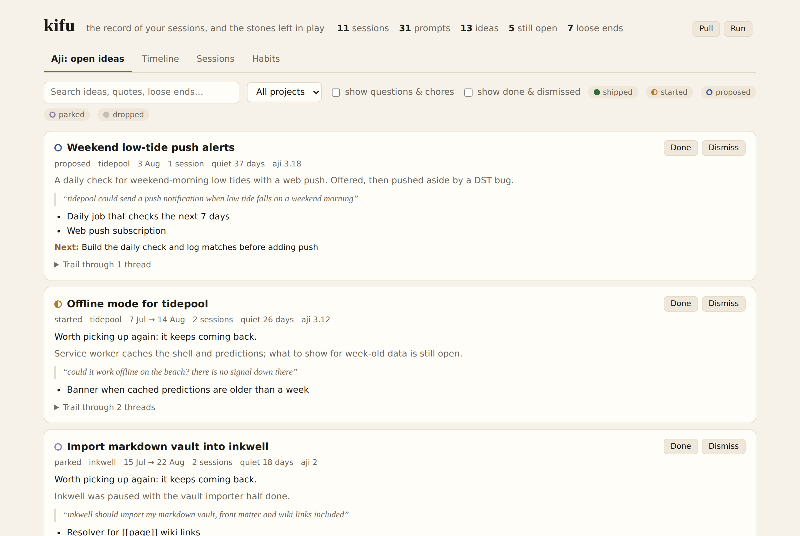
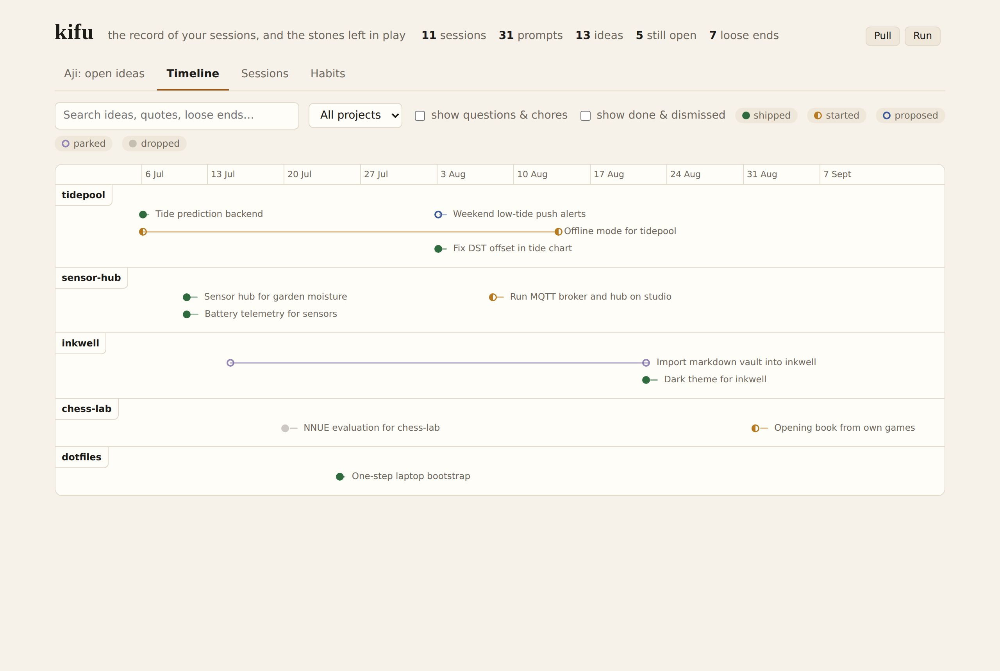
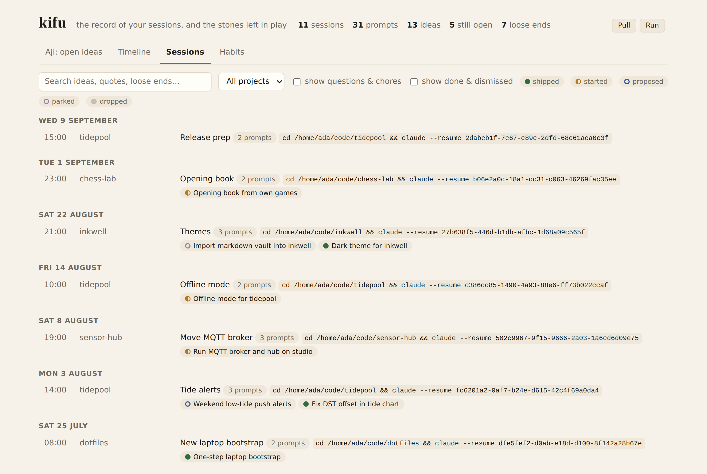
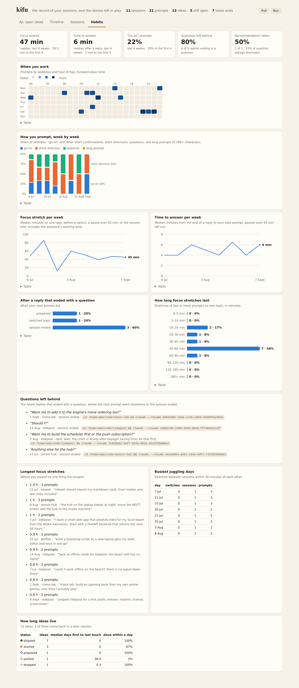
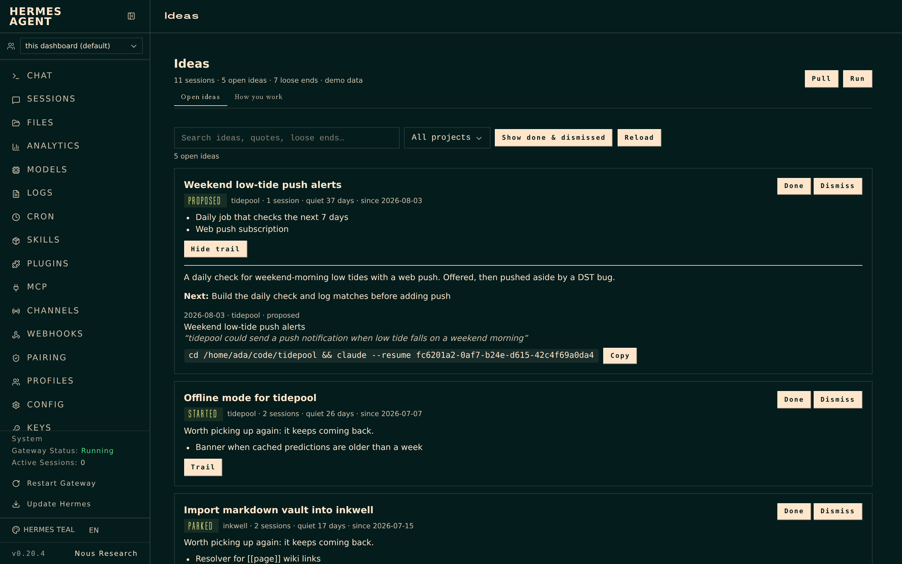

# kifu

**Find the ideas you left behind in your Claude Code sessions.**

kifu reads every Claude Code session on your machines, finds the ideas in them — the feature you
asked about at midnight, the offer you said yes to and never came back for, the list where only two
of four items got done — and follows each one across sessions and machines until it shipped, was
dropped, or went quiet. It also shows how you work: when you drive with "go on", when you are deep in
something, how long you stay on one thing, and how often a question from the assistant goes unanswered.



*Kifu* is the record of a game of Go. *Aji* — literally "taste" — is the potential left on the board:
stones that are not dead yet and can still come alive. kifu keeps the record and ranks the aji.

## Why

Working with Claude Code, ideas arrive faster than they get finished. A question turns into a design,
the design into three follow-ups, and then something breaks and the session moves on. The next idea
starts in a new session, sometimes on another machine. Nothing is lost — it is all in
`~/.claude/projects` — but nobody reads 2.7 GB of JSONL to find out what was left open.

On the machines this was built for, three months came to 297 sessions and 7,900 prompts on two
computers. kifu found 1,228 ideas in them; 506 were still open, with 1,489 concrete loose ends. One in
eight questions the assistant asked was never answered — the next prompt went somewhere else. And
Claude Code deletes session files after `cleanupPeriodDays` (30 by default): the oldest sessions were
already gone.

## What you get

**A web app** (`kifu serve`)

- **Aji:** open ideas, ranked by how much is left and how long they have been quiet. Each shows the
  verdict, the loose ends, your own words from the session that started it, and the command to resume
  that session — on the machine it ran on. Mark ideas done or dismissed; the marks survive re-analysis.
- **Timeline:** every idea as a line from its first to its last session, one lane per project.
- **Sessions:** day by day, which ideas lived in which session.
- **Habits:** when you work, how you prompt week by week, focus stretches, time to answer, juggling
  between sessions, questions left behind, how long ideas live.

| | |
|---|---|
|  |  |



**Inside Claude Code** (`kifu install claude`)

- **When a session starts,** the project's open ideas appear — to you, and to Claude as context:
  ```
  kifu: 2 open ideas in tidepool
    • Weekend low-tide push alerts (proposed, since 2026-08-03) — next: Daily job that checks the next 7 days
    • Offline mode for tidepool (started, since 2026-07-07) — next: Banner when cached predictions are older than a week
  ```
- **An MCP server** with `kifu_ideas`, `kifu_idea`, `kifu_brief` and `kifu_mark`, so Claude can answer "what did I
  leave open here?" mid-session.
- **`kifu resume <idea>`** starts a *new* session from a brief of the idea — what it was in your own words, the
  loose ends still open, what git shows happened since, the files it touched — on the machine it ran on.
  A fresh brief instead of a weeks-old context.
- **When a session ends,** it is queued and analyzed two quiet minutes later. No manual runs.
- **`/kifu`** as a slash command when installed as a plugin: `/plugin marketplace add gweber/kifu`, then
  `/plugin install kifu@kifu`.

**Corrections that stick:** rename an idea, merge two that are the same, or pull a thread out of an idea it
does not belong to. Your corrections survive every rebuild, and once you have marked a few dozen ideas done
or dismissed, scores lean towards what you actually pick up.

**Knowing why, and not repeating yourself**

- **`kifu blame file:line`** is git blame for intent: the session and your own prompt that wrote a line, the idea it
  belonged to, and the commit. It replays the edits recorded in the sessions that wrote the file; when no edit
  matches, it falls back to the commit message, then to timing, and says which. Claude can ask the same through
  the MCP tool `kifu_why` before changing code whose purpose is unclear.
- **Decisions and promises** (`kifu decisions`, `kifu promises`, MCP `kifu_decisions`): choices with their reasons
  ("Svelte instead of React, because the bundle stays small"), and what the assistant said it would do later and
  never did. Both show on the idea and in its brief.
- **Déjà vu:** when a new session's first prompts resemble an earlier idea, Claude gets the candidates as context
  and mentions one only when it is clearly what you are returning to.
- **`kifu rules`:** the corrections you keep repeating ("no shims", "stop pausing"), worded as rules and checked
  against your CLAUDE.md files and memory, with the file each belongs in.
- **`kifu memory-check`:** memory and CLAUDE.md files that name paths which are gone, memories the index never loads,
  and memory of projects that moved, with where their files are written now.
- **Effort:** time and tokens per idea, and where the time went: shipped, dropped, or parked after hours of work.
- **Journeys:** ideas that moved between tools, like a Hermes chat that became Claude Code work, and what became of them.

**A JSON API** with OpenAPI docs at `/docs`, including a compact form for agents and a digest of ideas
that went quiet.

**A terminal view:** `kifu ideas`, `kifu sessions`, `kifu show <session>`, `kifu threads`.

**A plugin for [Hermes Agent](https://github.com/NousResearch/hermes-agent)** — an Ideas tab in the
dashboard, three agent tools ("what did I leave unfinished in tidepool?"), `/kifu`, and a weekly digest — on
Telegram with Done, Dismiss and Brief buttons, at the hour you usually start coding if you like.
See [hermes-plugin/](hermes-plugin/).



## Try it without your own sessions

```bash
pip install "kifu[web] @ git+https://github.com/gweber/kifu"
kifu demo /tmp/kifu-demo
KIFU_CONFIG=/tmp/kifu-demo/config.toml kifu serve      # http://127.0.0.1:8765
```

The demo writes eleven made-up sessions in Claude Code's file format, analyzes them with scripted
answers and embeds them with a hashing function. No model is called.

## Use it on your sessions

You need Python 3.11+, and two model endpoints:

- **Analysis** reads each session once. The default is `claude -p` on your own Claude login (Sonnet,
  medium effort, no tools). Any OpenAI-compatible server works too: vLLM, Ollama, LiteLLM, a hosted API.
- **Embeddings** follow ideas across sessions. Any OpenAI-compatible `/v1/embeddings` endpoint; the
  default is Ollama with `bge-m3` (`ollama pull bge-m3`), which handles prompts in any language.

```bash
pip install "kifu[web] @ git+https://github.com/gweber/kifu"
mkdir -p ~/.config/kifu   # copy examples/config.toml from this repository there, and edit it
kifu run        # pull, scan, embed, analyze, link, verify — later runs only read what is new
kifu serve
kifu install claude    # optional: hooks and MCP server in Claude Code
```

`kifu config` prints the settings in effect. Every setting is described in
[examples/config.toml](examples/config.toml).

**Several machines:** add a `[[sources]]` entry with `ssh = "host"` per machine; `kifu pull` copies
their sessions over rsync.

**Other coding agents:** kifu also reads the histories of Codex CLI, Gemini CLI, Cline, Hermes Agent and
OpenCode — add a source with `kind = "codex"` (or `gemini`, `cline`, `hermes`, `opencode`); the path defaults to
where the tool keeps its history. An idea started in Codex and continued in Claude Code becomes one line, and
resume commands open each session in the tool it came from. Chat assistants' ideas rank at half weight
(`tool_weights`), private conversation is set aside as `personal` (`kifu reclassify` for older sessions), and
folders that are not projects can be listed in `ignore_projects`. Aider and Cursor are not supported yet.

**Keep the history:** `kifu pull` copies session files into an archive and never deletes. Run it more
often than Claude Code's cleanup runs — [examples/](examples/) has a systemd service and an hourly timer.

**Cost:** the first run reads every session; after that only new or continued sessions. Each call
sends a digest (your prompts plus the end of each reply), not the full transcript, and runs without
MCP servers, settings or skills: a session of a few dozen prompts is around ten thousand input tokens.

## How it works

| Stage | | |
|---|---|---|
| **pull** | rsync each machine's `~/.claude/projects` into an archive | never deletes |
| **scan** | turns: each prompt you typed — including messages sent while the assistant was still working, where the "by the way…" ideas hide — the end of the reply, when the work ended; evidence: files written, commits, pushes, PRs, deploys, question dialogs; forks and resumes; secrets redacted | deterministic, seconds |
| **embed** | fold "go on" and "yes do both" into the prompt they confirm; embed each move | local or any endpoint |
| **analyze** | a model reads each session's moves and lists its threads: title, kind, status, your quote, loose ends, next step | cached per session |
| **link** | group the same idea across sessions by embedding; a model consolidates each group — or splits it if the ideas are only related — and drops loose ends a later session settled; open ideas get an aji score | cached per group |
| **verify** | for each open idea, ask git — on the machine the session ran on — which commits touched its files after it went quiet; a model reads those commit messages against the loose ends | model calls only for ideas with later commits, cached |

Status comes from what the sessions show: writes and commits count as evidence, a reply that says
"done" does not. But work often finishes outside a session — from the terminal, another agent, a session
that never mentions the idea — so `verify` adds what git shows: *"20+ commits touched its files since it
went quiet; none of them address the loose ends"*, or a loose end struck through because a commit settled it.
An idea whose loose ends all look settled drops down the ranking and out of the digest, but stays visible.
It is evidence, not a verdict: ideas that wrote no files, or live outside a git repository, cannot be checked.

### What the habits measure

- **Modes:** *go on* (short confirmations), *short direction*, *question*, *long prompt* (280+ characters).
- **Focus stretch:** consecutive prompts on one topic, until a switch, a pause of more than 45 minutes
  after the assistant finished, or the end of the session. Topic changes come from the analyzed threads,
  with embeddings as a fallback. The assistant's working time is included.
- **Time to answer:** from the end of a reply to your next prompt, pauses left out.
- **Questions left behind:** replies ending in a question whose next prompt belongs to a different
  thread, or that ended the session.
- **Recommendation taken:** in question dialogs that marked an option as recommended.

These are measurements of a conversation log, not of a person: a long focus stretch can be a long
autonomous run, and a slow answer can be a phone call.

## Privacy

Everything is stored locally, and secrets in session text — API keys, tokens, passwords in URLs — are
redacted when kifu scans, before anything is stored, embedded or analyzed. Session digests go to the analysis backend you configure — Anthropic
with the default, where the sessions came from in the first place, or a local model if you point
`[analysis]` at one. The web app and API have no authentication and bind to `127.0.0.1`. See
[SECURITY.md](SECURITY.md).

## Development

```bash
pip install -e ".[dev]"
pytest -q tests/
ruff check kifu tests hermes-plugin

# the dashboard plugin, rendered and clicked through in jsdom
python tests/dump_plugin_fixtures.py /tmp/kifu-fixtures.json
npm install --no-save react react-dom jsdom
KIFU_FIXTURES=/tmp/kifu-fixtures.json node hermes-plugin/dashboard/render_check.js
```

The tests run against the demo store: no network, no model.

## License

MIT
